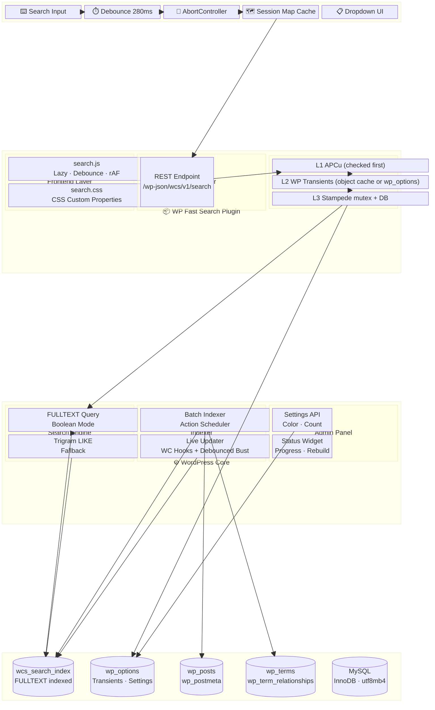
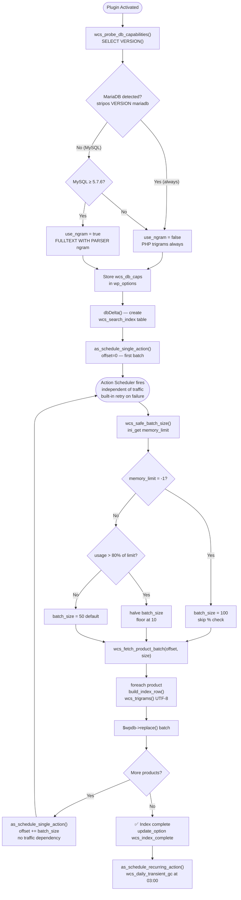
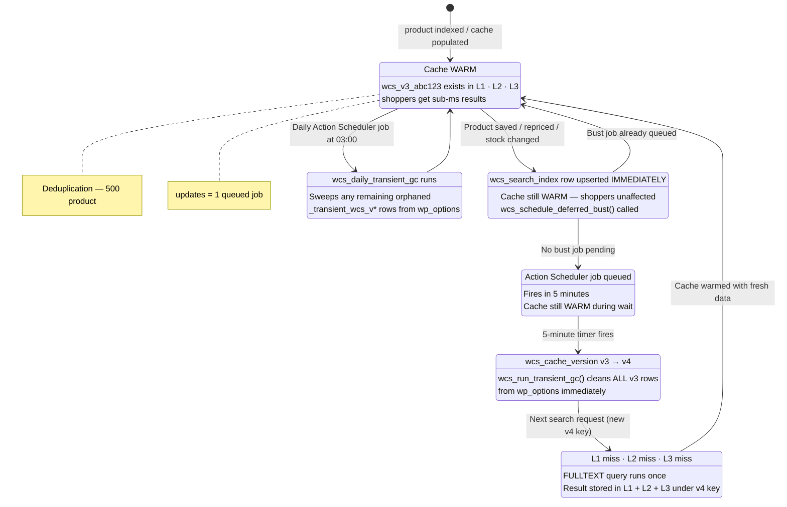
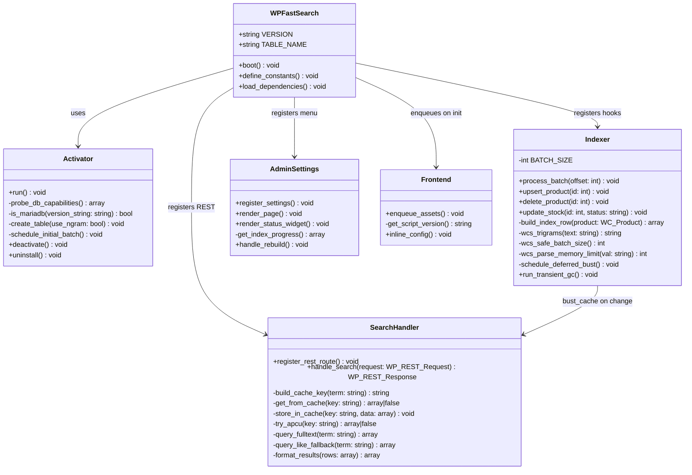
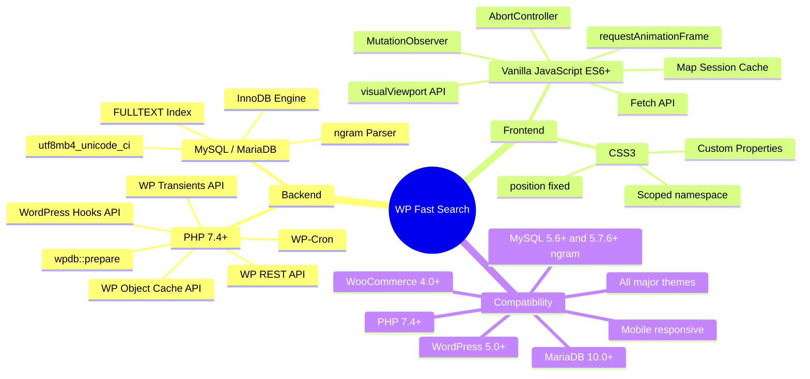

# WP Fast Search — Architecture Diagram

---

## System Layers



---

## 4. Product Lifecycle & Index Sync

```mermaid
sequenceDiagram
    actor Admin
    participant WC as WooCommerce
    participant Indexer as Indexer Module
    participant AS as Action Scheduler
    participant DB as wcs_search_index
    participant Cache as Cache Layer
    participant OPT as wp_options

    Admin->>WC: Save / Edit product
    WC->>Indexer: save_post_product hook
    Indexer->>Indexer: build_index_row(product)
    Indexer->>DB: $wpdb->replace() — upsert 1 row IMMEDIATELY
    Note over DB: Index is fresh instantly
    Note over Cache: Cache stays WARM during this

    Indexer->>AS: wcs_schedule_deferred_bust()
    AS->>AS: as_next_scheduled_action('wcs_deferred_cache_bust')?
    alt Bust already queued
        AS-->>Indexer: Skip — deduplication guard
    else No bust pending
        AS-->>Indexer: Queued for T+5 minutes
    end

    Note over AS: 5 minutes later...
    AS->>OPT: update wcs_cache_version v3 → v4
    AS->>OPT: wcs_run_transient_gc()
    Note over OPT: DELETE _transient_timeout_wcs_v3_*
    Note over OPT: No wp_options bloat

    Admin->>WC: Delete product
    WC->>Indexer: before_delete_post hook
    Indexer->>DB: DELETE WHERE id = product_id
    Indexer->>AS: wcs_schedule_deferred_bust()

    Note over AS: Daily at 03:00...
    AS->>OPT: wcs_daily_transient_gc()
    Note over OPT: Sweep any remaining orphaned rows
```

---

## 5. Initial Batch Indexing Flow



---

## 3. Cache Invalidation Strategy



---

## Plugin Internal Architecture



---

## Technology Stack


