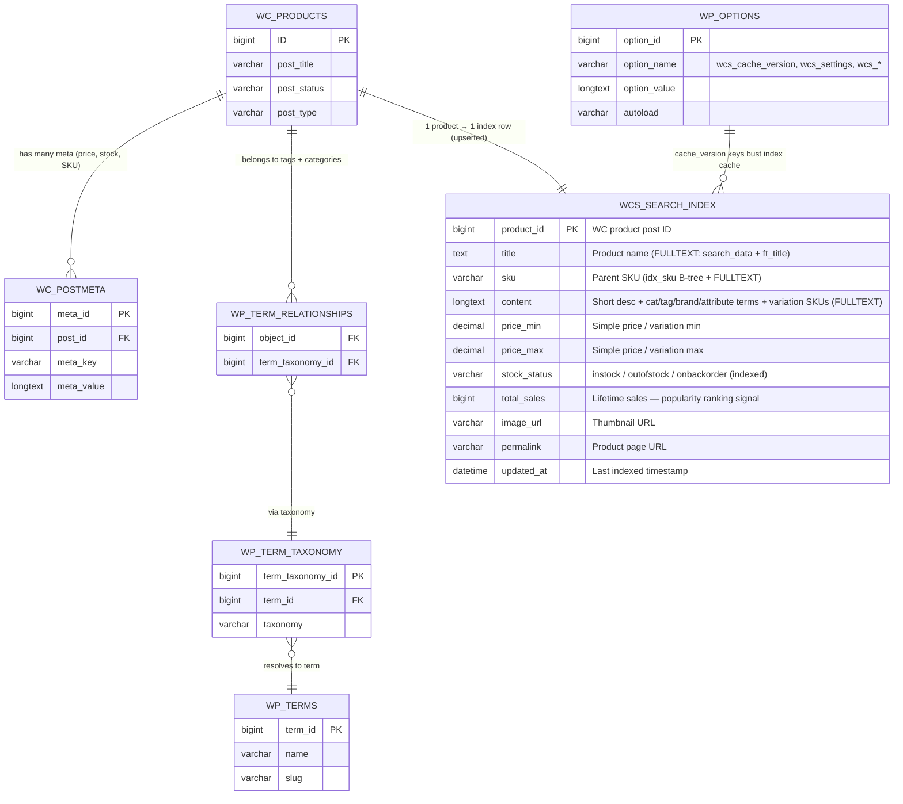
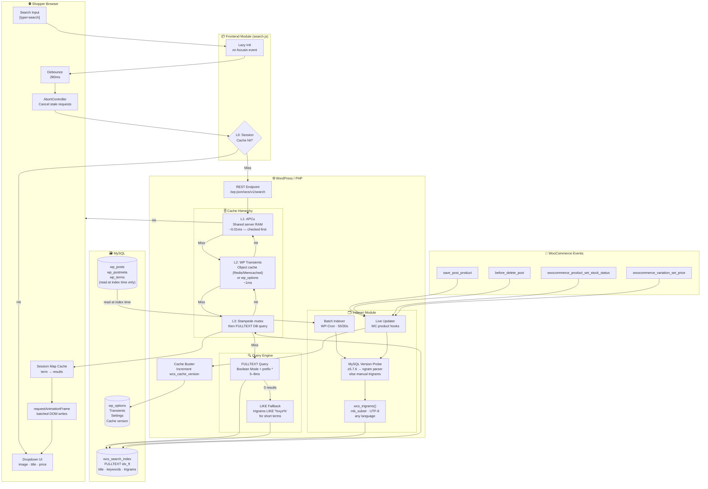
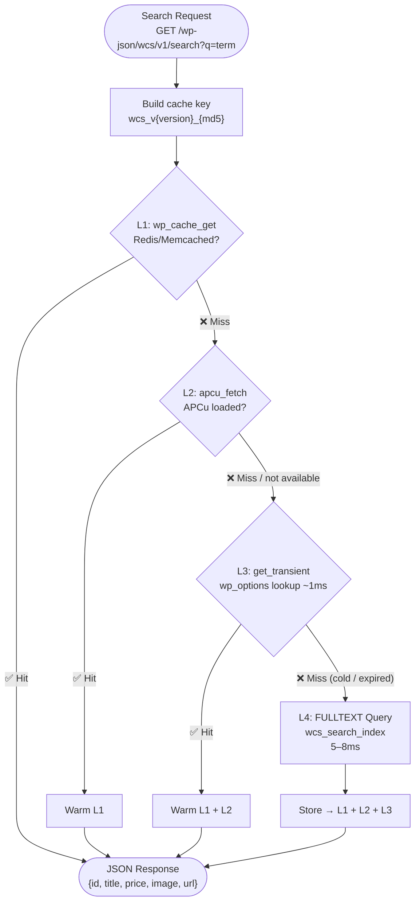
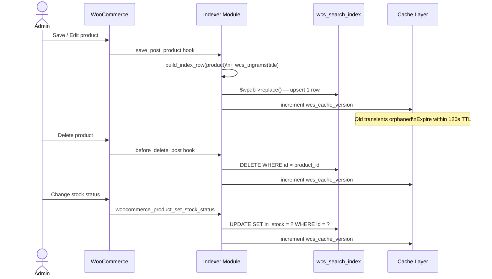
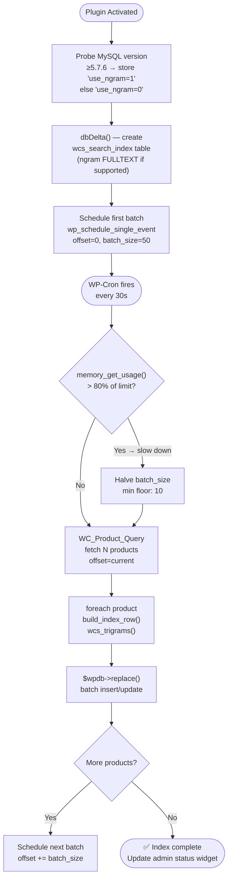

# WP Fast Search — ERD & System Architecture

---

## 1. Database Entity Relationship Diagram



> **Key design point:** `wcs_search_index` is the ONLY table touched at search time.
> All other tables (postmeta, terms, relationships) are read **only at index time**, never at query time.

---

## 2. System Component Diagram



---

## 3. Cache Degradation Flow



---

## 4. Product Lifecycle & Index Sync



---

## 5. Initial Batch Indexing Flow



---

## 6. File Structure

```
wp-fast-search/
│
├── wp-fast-search.php              # Plugin header, constants, bootstrap
│
├── includes/
│   ├── class-activator.php         # Activation, MySQL probe, table creation, cron schedule
│   ├── class-indexer.php           # Batch + live indexing, trigram generator
│   ├── class-search-handler.php    # REST endpoint, 4-level cache, query tiers
│   ├── class-frontend.php          # Enqueue scripts/styles, inline wcs_config JS object
│   └── class-admin-settings.php   # WP Settings API, index status widget
│
├── assets/
│   ├── js/search.js                # Vanilla JS: debounce, AbortController, Map cache, rAF
│   └── css/search.css              # Scoped .wcs-dropdown styles + CSS custom properties
│
├── languages/
│   └── wp-fast-search.pot          # i18n strings
│
└── uninstall.php                   # DROP table, DELETE options, clear transients
```

---

## 7. Performance Targets Summary

| Metric | Target | Mechanism |
|---|---|---|
| Cold search (no cache) | < 8ms | FULLTEXT on flat table |
| Warm search (L3 transient) | ~1ms | wp_options indexed lookup |
| Warm search (L1/L2) | < 1ms | Redis / APCu |
| Repeat search same session | < 1ms | JS session Map() |
| Page load overhead | 0ms | Lazy JS init on focusin |
| JS bundle size | < 7KB min | No framework, no jQuery |
| Requests per keystroke | ≤ 1/280ms | Debounce + AbortController |
| Index build (1000 products) | ~10 min | 50/batch × 30s interval |
| Memory per search request | < 2MB | Raw $wpdb, no WP template |
| Concurrent searches | Unlimited | Stateless, read-only |
